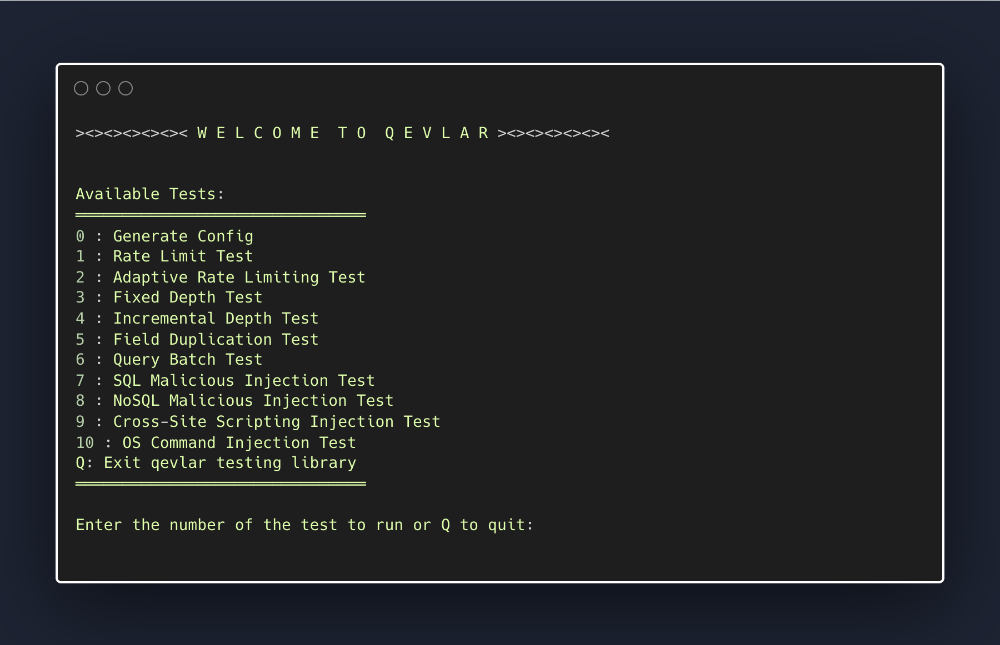

<h1 align="center">Welcome to Qevlar</h1>
<p align="center">
  <a href="https://www.npmjs.com/package/qevlar" target="_blank">
    
  </a>
  <a href="https://github.com/oslabs-beta/Qevlar/graphs/commit-activity" target="_blank">
    
  </a>
</p>

##

### [qevlar.dev](qevlar.dev)

Qevlar is a dependency-free security testing library for GraphQL APIs that runs directly from your CLI. It assesses vulnerabilities to a multitude of DoS attacks, malicious SQL/NoSQL injections, and more.

## Test Overview

### Select test from test menu:

Easily choose which tests to run, right from your CLI, featuring built-in type checking.



### Query depth limiting test example:

Tests each depth level up to `QUERY_DEPTH_LIMIT`.


### SQL injection test example:

Tests vulnerability to 100s of malicous SQL injection payloads.


### Rate limiting test example:

Tests from `INITIAL_RATE` up to `QUERY_RATE_LIMIT` at each `INCREMENT`.


## Installation

```sh
npm install qevlar
```

## Setup

1. Run start command:

```
npm qevlar
```

2. To manually customize config, edit the relevant fields in `qevlarConfig.json`. It's initialized as:

```
{
  "ANY_TOP_LEVEL_FIELD_ID": "",
  "API_URL": "",
  "BATCH_SIZE": 10,
  "CIRCULAR_REF_FIELD": "",
  "INCREMENT": 10,
  "INITIAL_RATE": 10,
  "NO_SQL": false,
  "QUERY_DEPTH_LIMIT": 5,
  "QUERY_RATE_LIMIT": 100,
  "SQL": false,
  "SQL_COLUMN_NAME": "",
  "SQL_TABLE_NAME": "",
  "SUB_FIELD": "id",
  "TIME_WINDOW": 1000,
  "TOP_LEVEL_FIELD": ""
}
```

3. To generate `qevlarConfig.json` automatically, select `0` in your CLI and submit your API's URL when prompted. This will introspect your Graph QL API, aquiring field names, then automatically update `qevlarConfig.json`.
4. After, select the test you want to run. Results will be displayed in your CLI!

## Contributing

Contributions, issues and feature requests are welcome!<br />

### Branch management

Please submit any pull requests to the dev branch. All changes will be reviewed before merging by OSLabs and prior contributors.

### Bugs and suggestions

For help with existing issues, please read our GitHub [issues page](https://github.com/oslabs-beta/qevlar/issues).
If you cannot find support in the issues page, please file a report on the same issues page.

Suggestions and other feedback are more than welcome.

## Future Direction

- Perform query cost analysis, allowing addition of cost limiting tests to the library
- Package security solutions to these attacks in their own library
- Introspection Tests
- Jest/End-to-end testing
- GUI standalone application to run tests from
- Authentication/Authorization

## Meet the team 🧑‍🚀

Joshua McDaniel [GitHub](https://github.com/joshuamcdaniel95) | [LinkedIn](https://www.linkedin.com/in/joshuamcdanielxyz/) | [Email](mailto:jwilliammcdaniel@gmail.com)<br />
Conor Bell [GitHub](https://github.com/conorbell) | [LinkedIn](https://www.linkedin.com/in/conor-bell/) | [Email](mailto:conorbell27@gmail.com)<br />
Hyung Noh [GitHub](https://github.com/johniskorean) | [LinkedIn](https://www.linkedin.com/in/johniskorean/) | [Email](mailto:johnhyungilnoh@gmail.com)<br />
Landon Osteen [GitHub](https://github.com/LandonOsteen) | [LinkedIn](https://www.linkedin.com/in/landonosteen/) | [Email](mailto:landonwyatteosteen@gmail.com)
<br />
<br />
We're just a couple devs who love open-source solutions.

GitHub stars are welcomed, but really we're happy just building things people want to use.

Check Qevlar out on LinkedIn [here](https://www.linkedin.com/company/qevlarxyz/about/).

## License

_This project is [ISC](https://github.com/oslabs-beta/Qevlar/blob/master/LICENSE) licensed._
